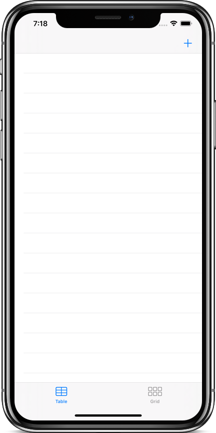
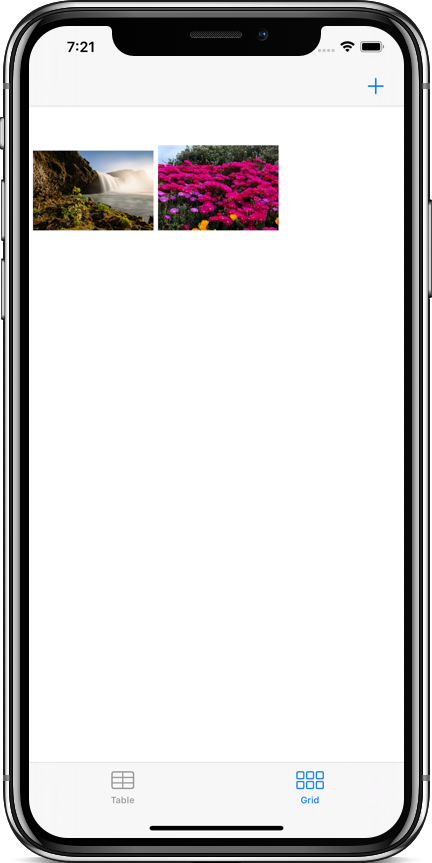
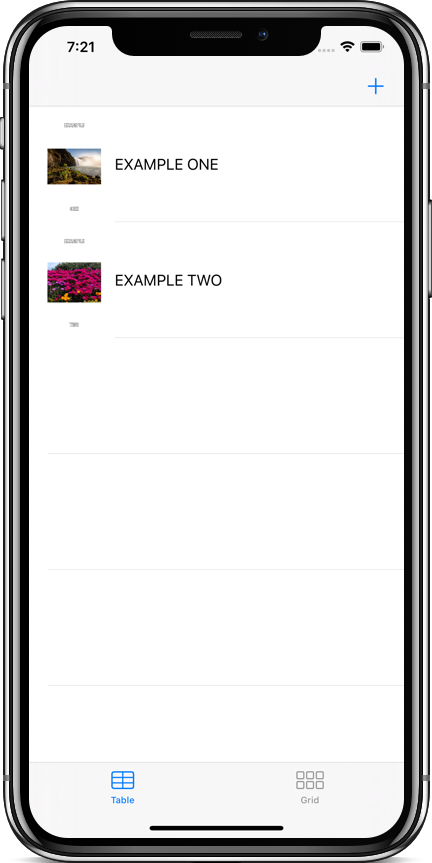
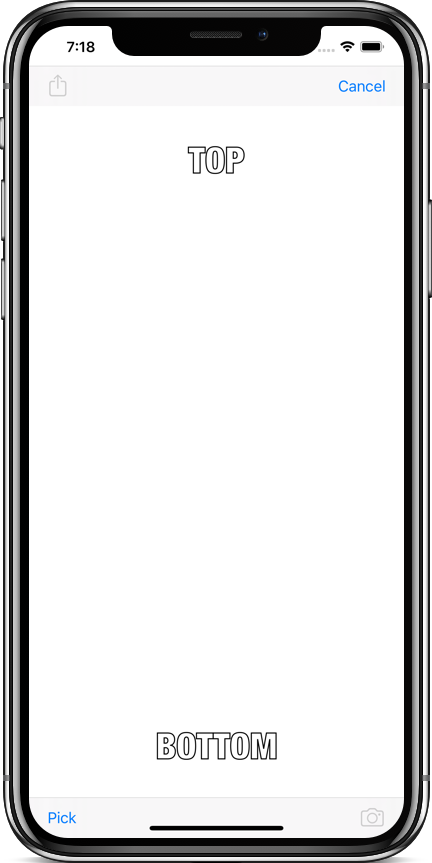
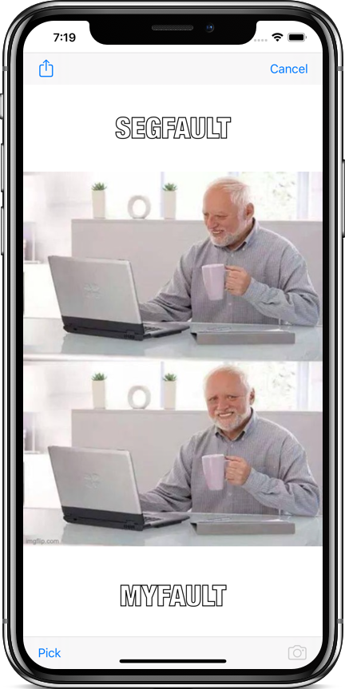

# Meme Me
With Meme Me you can turn your images into memes conveniently. The app lets you to take a picture or choose one from your gallery, and add text at the top and bottom to form a meme, and share the meme with friends. You can view your shared memes in a list or a grid view.

## Screenshots

#### Meme Collection
| Empty Screen | Collection | Table |
| ------------ | ---------- | ----- |
|  |  |  |

#### Meme Editor
| Empty | Editing |
| ----- | ------- |
|  |  |

## Frameworks Used
1. [Foundation](https://developer.apple.com/documentation/foundation)
2. [UIKit](https://developer.apple.com/documentation/uikit)

## How to Build
1. Download or clone the project.
2. Open `MemeMe.xcodeproj` file in Xcode.
3. Build & Run the app.