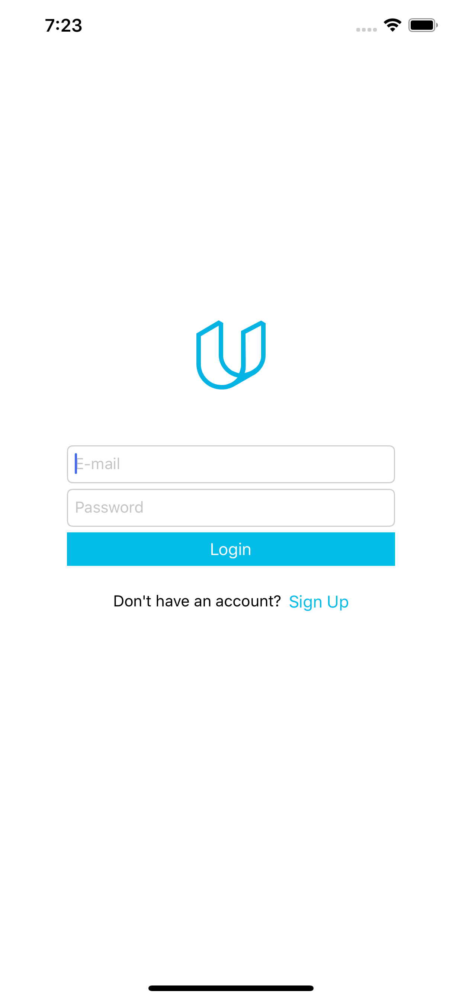
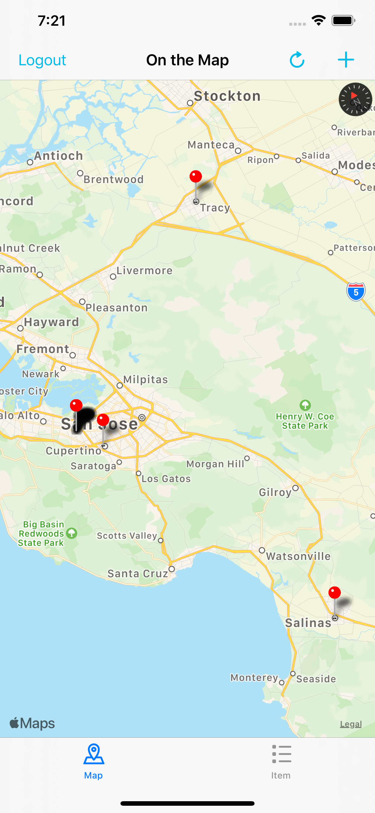
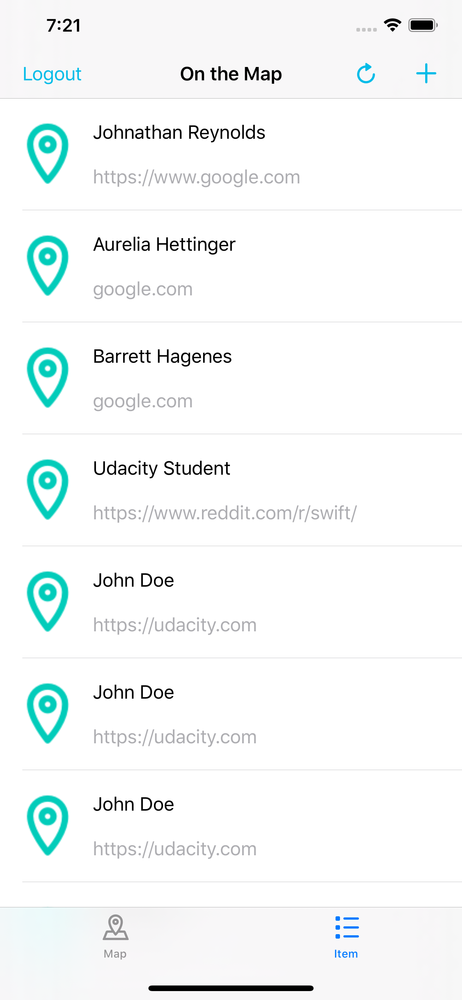
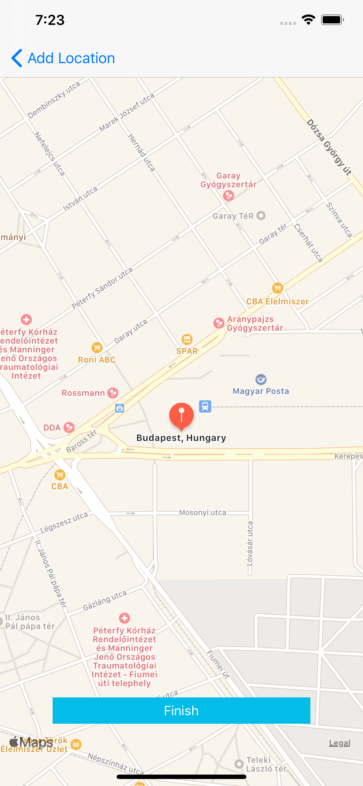

# On The Map
On The Map shows information posted by other Udacity students.
The app uses Udacity's Authentication and Parse APIs. 
If the posted information is a valid URL the app let's you open it in Safari as well.

# Screenshots

| Login Screen | Map View | List View |
| ------------ | ----------- | ---- |
|  |  | 

| Add Pin | Finalize Pin |
| ------- | ----------- |
|  |  |

## Frameworks Used
1. [Foundation](https://developer.apple.com/documentation/foundation)
2. [UIKit](https://developer.apple.com/documentation/uikit)
3. [MapKit](https://developer.apple.com/documentation/mapkit)