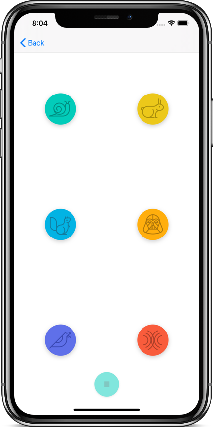

# Pitch Perfect
Pitch Perfect is an app that record's your voice and plays it back in different tones.

## Screenshots
| Home Screen: Idle | Home Screen: Recording | Play Sounds Screen |
| ----------------- | ---------------------- | ------------------ |
|  |  |  |

## Frameworks Used
1. [Foundation](https://developer.apple.com/documentation/foundation)
2. [UIKit](https://developer.apple.com/documentation/uikit)
3. [AVFoundation](https://developer.apple.com/documentation/avfoundation)

## How to Build
1. Download or clone the project.
2. Open `PitchPerfect.xcodeproj` file in Xcode.
3. Build & Run the app.